# MANUAL DE OPERACAO - VERSAO IMPRESSAO ILUSTRADA

Versao: 1.0  
Data: 11/03/2026  
Publico: Operador, Tecnico, Planejador, Gestor e ADMIN do tenant

---

## 1) Objetivo desta versao

Este documento e uma versao resumida para impressao, com foco em execucao operacional e imagens de passo a passo para as atividades criticas do processo.

---

## 2) Mapa rapido da rotina

1. Login e acesso ao ambiente.
2. Abertura e priorizacao de demandas.
3. Emissao e fechamento de O.S.
4. Planejamento preventivo/preditivo.
5. Seguranca (SSMA) e RCA.
6. Analise de custos e relatorios.

Imagem do fluxo inicial:  
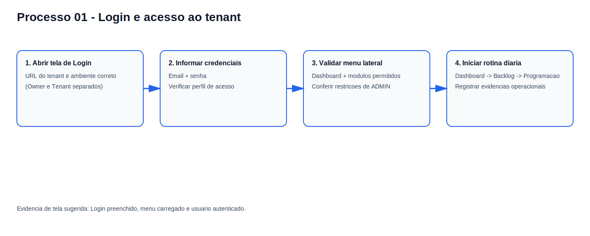

---

## 3) Passo a passo ilustrado por atividade

### 3.1 Abertura de solicitacao

1. Acessar menu Solicitacoes.
2. Informar TAG e descricao da falha.
3. Classificar urgencia e impacto.
4. Salvar para gerar SLA e fila.

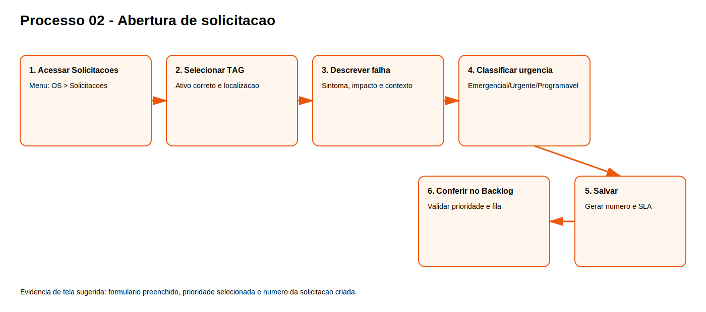

### 3.2 Emissao de O.S

1. Abrir Emitir O.S.
2. Definir TAG, tipo e prioridade.
3. Informar solicitante e problema.
4. Salvar e imprimir ficha de execucao.

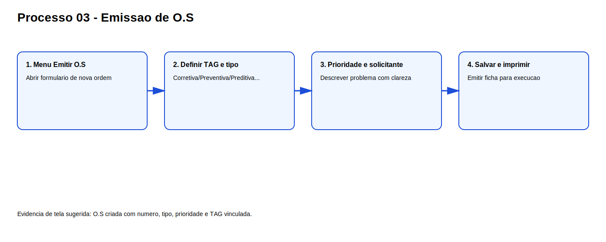

### 3.3 Fechamento de O.S

1. Selecionar ordem em aberto.
2. Registrar horas e servico executado.
3. Apontar materiais e custos.
4. Fechar ordem e validar historico.
5. Em corretiva, preencher RCA.

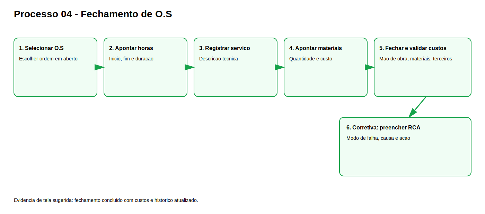

### 3.4 Programacao semanal

1. Abrir agenda da semana.
2. Priorizar backlog e urgencias.
3. Distribuir atividades por recurso.
4. Emitir O.S da programacao.

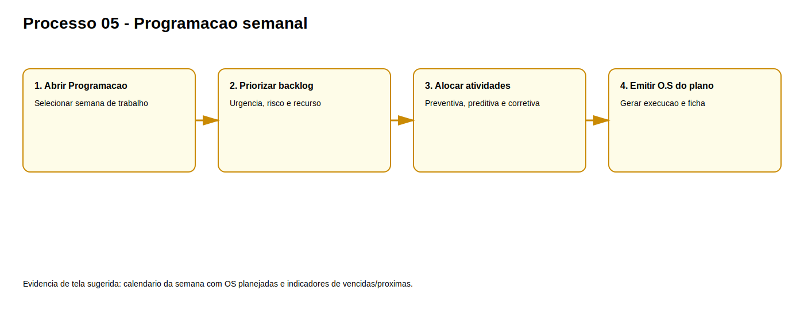

### 3.5 Plano preventiva

1. Criar plano por TAG.
2. Definir atividades e frequencia.
3. Ativar plano.
4. Programar execucao.
5. Registrar historico e aderencia.

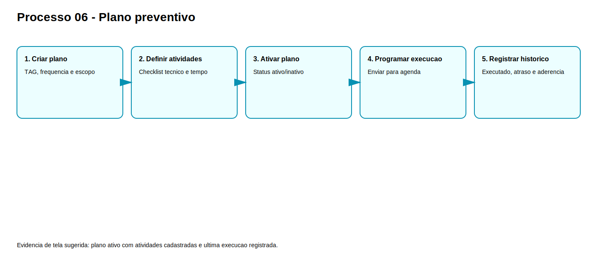

### 3.6 Preditiva e alertas

1. Registrar medicao.
2. Aplicar limites.
3. Tratar alertas ativos.
4. Abrir O.S ou RCA quando necessario.

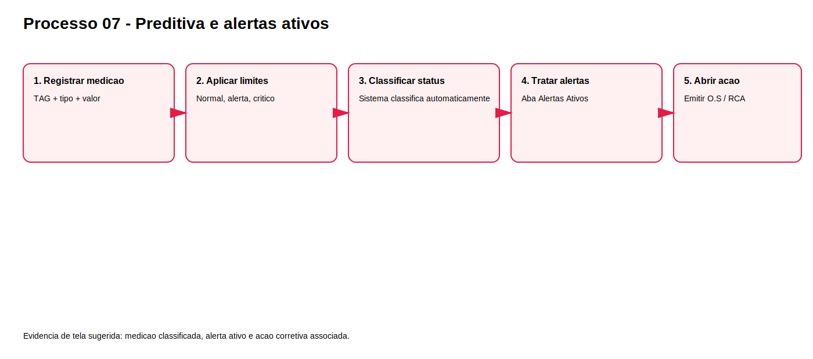

### 3.7 SSMA - Incidente

1. Abrir SSMA > Incidentes.
2. Classificar tipo e severidade.
3. Registrar evidencias e acoes imediatas.
4. Salvar e comunicar responsaveis.

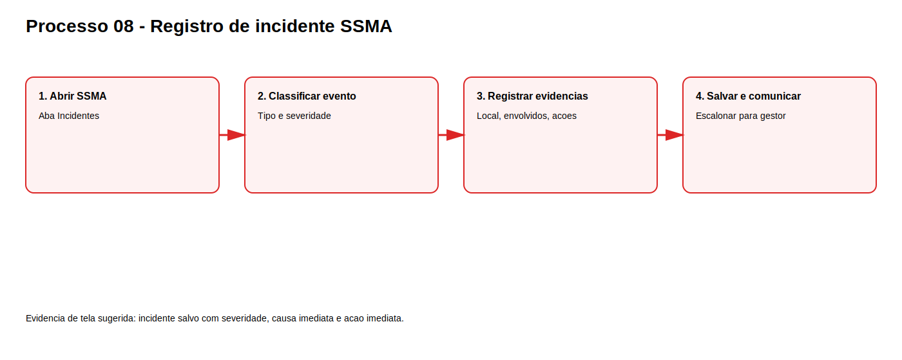

### 3.8 SSMA - Permissao de Trabalho (PT)

1. Abrir SSMA > PT.
2. Definir tipo de permissao.
3. Registrar riscos, controles e EPIs.
4. Definir executante/supervisor/aprovador.
5. Salvar liberacao.

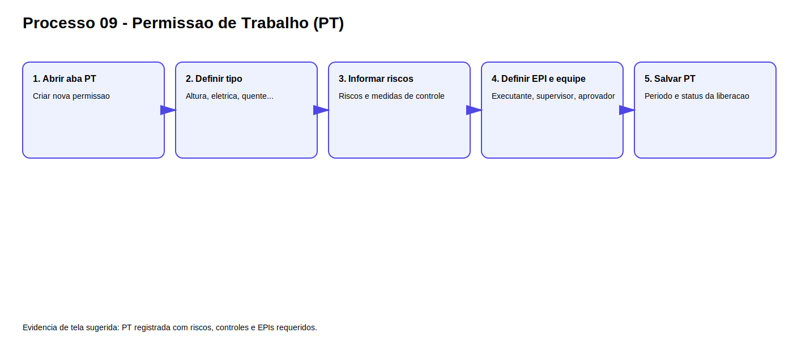

### 3.9 RCA

1. Criar analise de causa raiz.
2. Definir metodo.
3. Registrar causa confirmada.
4. Definir acao corretiva e eficacia.

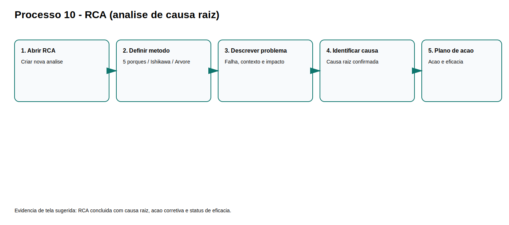

### 3.10 Custos e relatorios

1. Abrir modulo Custos.
2. Selecionar periodo e composicao.
3. Avaliar ranking por equipamento.
4. Emitir relatorio gerencial.

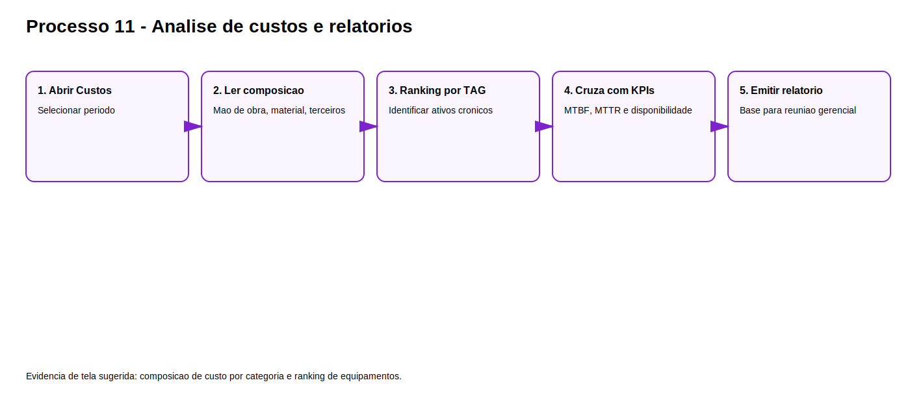

---

## 4) Checklists por turno (impressao rapida)

### Inicio do turno

1. [ ] Dashboard revisado.
2. [ ] Backlog priorizado.
3. [ ] Programacao confirmada.
4. [ ] Alertas de preditiva avaliados.
5. [ ] Itens de baixo estoque verificados.

### Meio do turno

1. [ ] O.S criticas sem bloqueio.
2. [ ] Materiais apontados corretamente.
3. [ ] Desvios escalonados.

### Fim do turno

1. [ ] O.S fechadas com dados completos.
2. [ ] Pendencias repassadas.
3. [ ] Resumo de turno registrado.

---

## 5) Matriz RACI resumida

| Modulo | OP | TEC | PCM | GEST | ADM |
| --- | --- | --- | --- | --- | --- |
| Solicitacoes | R | I | C | A | C |
| O.S (emitir/fechar) | I | R | C | A | I |
| Programacao | I | C | R | A | I |
| Preventiva/Preditiva | I | C | R | A | C |
| SSMA | R | R | C | A | I |
| Custos/Relatorios | I | C | R | A | C |
| Usuarios/Auditoria | I | I | I | A | R |

---

## 6) Controle de revisao

- versao: 1.0 (impressao ilustrada)
- data: 11/03/2026
- origem: consolidado a partir do manual operacional principal
